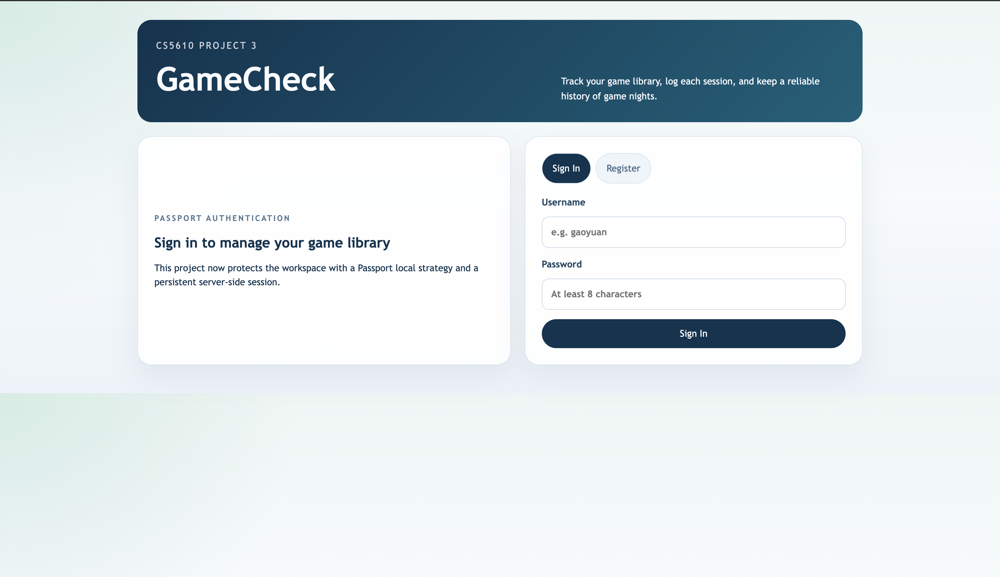
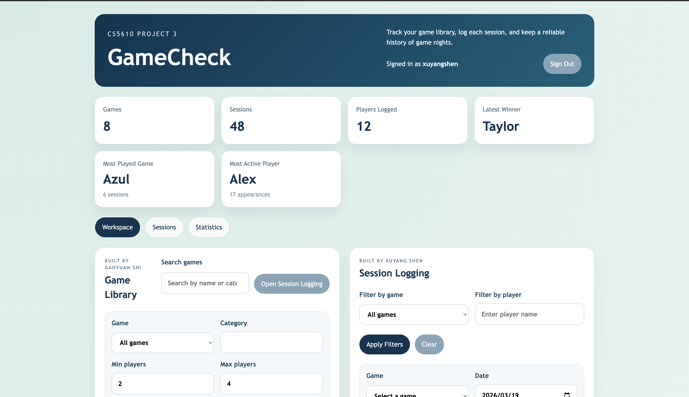
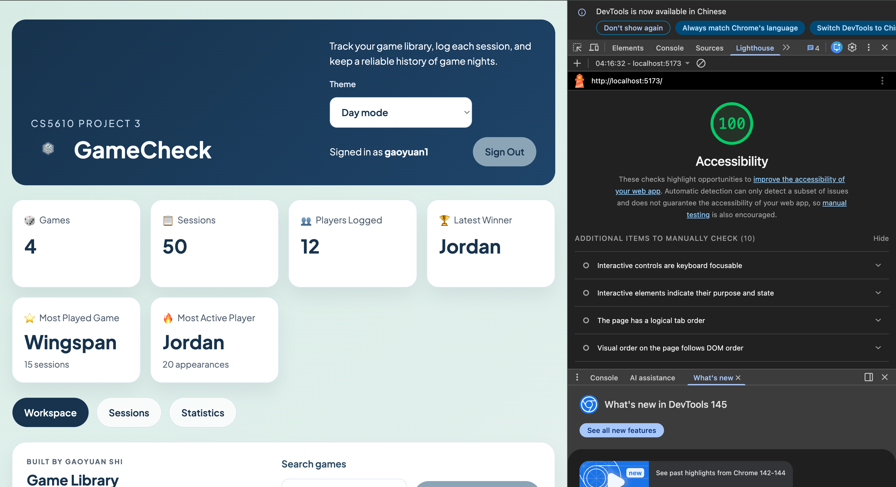

# GameCheck

## Authors

- Gaoyuan Shi
- Xuyang Shen

## Class Link

- CS5610 Project 3

## Live Demo

- [https://gamecheck-ro7u.onrender.com](https://gamecheck-ro7u.onrender.com)

## Project Objective

GameCheck is a full-stack web application for tracking a personal board game library, recording game night sessions, and reviewing player statistics. The project follows the required CS5610 Project 3 stack: Node.js, Express, client-side rendered React with Hooks, and MongoDB using the official Node.js driver.
It now also implements authentication using Passport with a local username/password strategy and server-side sessions.

## Team Scope And Independent User Stories

### Gaoyuan Shi

- Build and maintain the game library workspace, including game browsing, search, selection, and game metadata editing.
- Extend the product with player statistics and history views, including summaries, win rates, streaks, and head-to-head insights.
- Implement the full stack for these stories, including React UI, API integration, and backend data support.

### Xuyang Shen

- Build and maintain the session logging workflow, including creating, editing, deleting, and filtering logged play sessions.
- Implement the dashboard and session-oriented interactions for reviewing recent activity and session summaries.
- Implement the full stack for these stories, including React UI, Express routes, and MongoDB persistence.

## Instructions to Build

### Backend

1. Copy `backend/.env.example` to `backend/.env`.
2. Install dependencies in `backend/`.
3. Start MongoDB locally or provide a MongoDB connection string.
4. Run `npm run seed` to generate synthetic data.
5. Run `npm run dev` or `npm start`.

### Frontend

1. Install dependencies in `frontend/`.
2. Optional: create `frontend/.env` with `VITE_API_BASE_URL=http://localhost:4000/api`.
3. Run `npm run dev`.

## Features: Data & Pagination

The database is pre-populated with **1000+ synthetic session records** distributed across multiple games:
- **4 board games**: Azul, Catan, Codenames, Wingspan
- **12 recurring player profiles** with varied group combinations and weighted winners for realistic session patterns
- **260 sessions per game** for a total of **1040 seeded sessions**
- **Session pagination**: The frontend displays 50 sessions per page with a "Load More" button to fetch additional pages
- **Dynamic player suggestions**: Based on actual session participation

This ensures the application can handle realistic data volumes while keeping the UI responsive through pagination.

## Render Deployment

This repository includes a root-level [render.yaml](./render.yaml) so you can deploy the app as a single Render web service.

1. Push the repository to GitHub.
2. Create a MongoDB Atlas cluster and copy the application connection string.
3. In Render, click `New` -> `Blueprint` and select this repository.
4. When prompted for `MONGO_URI`, paste your Atlas connection string.
5. Complete the deploy. Render will build the React frontend, start the Express server, and serve the built frontend from the same service.
6. After the first deploy, seed the cloud database from your machine with:

```bash
MONGO_URI="your-atlas-connection-string" npm run render-seed
```

7. Open the Render service URL and verify that the dashboard, game library, and session logging features work.

## Screenshots

### Authentication

Passport-based sign-in and registration protect the workspace before any game or session data is shown.



### Workspace Overview

The main workspace combines the dashboard, game library, and session logging tools in a single view.



## Accessibility

The application was audited with **Chrome Lighthouse** and achieves a perfect **100 / 100 Accessibility score** in Day mode.



Key improvements made to reach this score:

| Issue | Fix |
|---|---|
| `button-secondary` (Sign Out, Cancel, etc.) had white text on a medium-gray background — contrast ratio ~2.4:1 | Changed text color to `var(--color-text)` (dark) so the ratio meets WCAG AA (≥ 4.5:1) across all four themes |
| `.panel__eyebrow` label text used `opacity: 0.88` which diluted the contrast below 4.5:1 at its small font size (0.72 rem) | Removed the opacity and kept the full token color `--color-text-muted` |
| Header and Statistics hero eyebrow labels used `opacity: 0.8 / 0.78` instead of an explicit color | Replaced with explicit WCAG-safe color values |
| Night-mode hero section used `--color-primary` (light periwinkle) as a gradient background behind near-white text | Added a night-mode override with a dark navy-to-teal gradient |
| Histogram chart cards used a hardcoded white background (`rgba(255,255,255,0.95)`), causing light theme-variable text to appear on white in night mode | Replaced with `var(--color-surface)` so the background adapts to the active theme |

## Feature Scope

- Create, edit, delete, search, and browse games in the library.
- Create, edit, delete, filter, and browse logged sessions with **pagination** (50 sessions per page).
- Filter sessions by game and player with smart pagination reset.
- View a lightweight dashboard summary for games, sessions, players, and the latest winner.
- View player statistics such as win rates, streaks, rivalry matchups, and most-played games.

## Project Structure

- `backend/`: Express API, MongoDB driver integration, and seed script.
- `frontend/`: React client with hooks, PropTypes, and component-scoped CSS.

## Assignment Notes

- The project uses `fetch` on the frontend and the MongoDB Node driver on the backend.
- The project intentionally avoids `axios`, `mongoose`, and the `cors` package to align with the assignment restrictions.

## AI Usage Disclosure

- AI tools were used for limited development support such as debugging, wording cleanup, and small UI/code refinements.
- The application structure, implementation decisions, and final review were completed by the project team.
